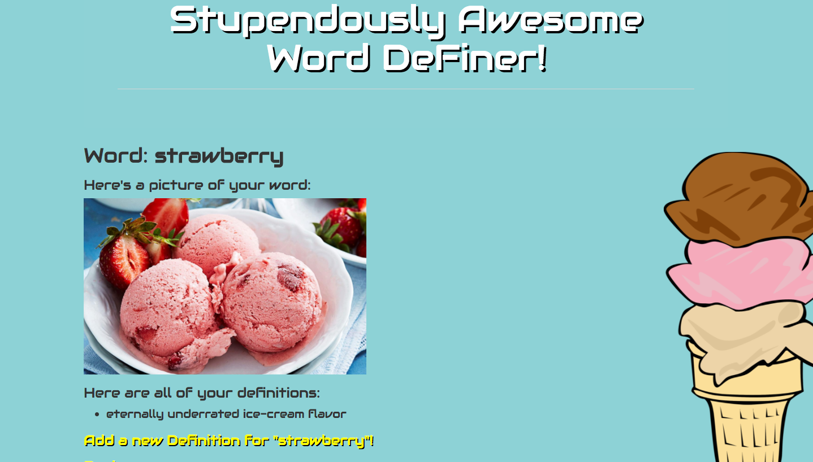

# Word Definer

##### Ruby - Week 2

#### By Grady L Shelton

## Description
This website for children, allowing them to add words to a list and then for each word add their own unique and possibly zany definitions!

Website can be viewed in browser at https:.herokuapp.com/

## Specifications

| behavior |  input   |  output  |
|----------|:--------:|:--------:|
|Program allows user to add a new word to a list|user inputs "ruby" in 'add word' page|result: homepage displays "ruby"|
|Program allows user to click on each word to see its definition(s)|user clicks "ruby"|result: taken to its definition page|
|Program allows user to add a definition from a word's definition page|user inputs "an awesome jewel!" in the 'add definition' page|result: definition page displays "an awesome jewel!"|
|Program allows user to add MULTIPLE definitions from a word's definition page|user inputs "an awesome programming langauge!...apparently"|result: definition page displays the first definition, "an awesome jewel!", and the second definition, "an awesome programming langauge!...apparently"|
|Program allows user to add a picture via url link to display with a word|user inputs "dog" for word and "example.jpg" for url|result: dog and image appear together in definition page **(screenshot below)**|

## Word Screenshot

## Setup/Installation Requirements

- [ ] Clone this repository
- [ ] Create new branch to make changes to code
- [ ] Open files in atom or text editor of your choice
- [ ] Open index.html in browser of your choice

## Known Bugs
No known bugs
## Contact

Please contact Grady L Shelton at gradyish@gmail.com if you have any questions.

## Technologies Used

HTML, CSS, Bootstrap, Ruby, Sinatra. Full list of gems used can be found in Gemfile.

### Legal

Copyright (c) 2017 **Grady L Shelton**

This software is licensed under the MIT license.

Permission is hereby granted, free of charge, to any person obtaining a copy
of this software and associated documentation files (the "Software"), to deal
in the Software without restriction, including without limitation the rights
to use, copy, modify, merge, publish, distribute, sublicense, and/or sell
copies of the Software, and to permit persons to whom the Software is
furnished to do so, subject to the following conditions:

The above copyright notice and this permission notice shall be included in
all copies or substantial portions of the Software.

THE SOFTWARE IS PROVIDED "AS IS", WITHOUT WARRANTY OF ANY KIND, EXPRESS OR
IMPLIED, INCLUDING BUT NOT LIMITED TO THE WARRANTIES OF MERCHANTABILITY,
FITNESS FOR A PARTICULAR PURPOSE AND NONINFRINGEMENT. IN NO EVENT SHALL THE
AUTHORS OR COPYRIGHT HOLDERS BE LIABLE FOR ANY CLAIM, DAMAGES OR OTHER
LIABILITY, WHETHER IN AN ACTION OF CONTRACT, TORT OR OTHERWISE, ARISING FROM,
OUT OF OR IN CONNECTION WITH THE SOFTWARE OR THE USE OR OTHER DEALINGS IN
THE SOFTWARE.
